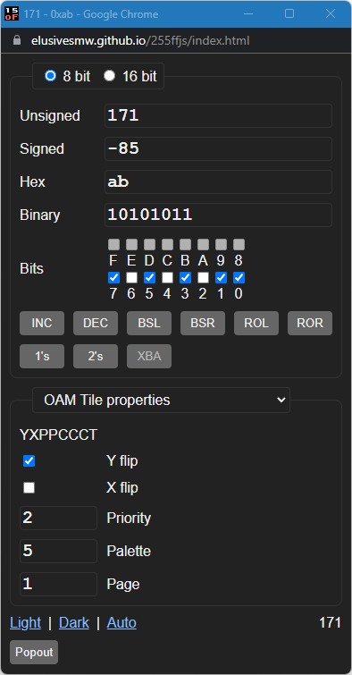

# 255FFjs

This project was created to help do conversitions with various formatting while working on assembly for SNES. The goal is to be easier to use than the windows calculator while serving a more specific purpose.

Intentionally, this project uses no 3rd party libraries or frameworks.

For offline use, the `views.js` file can be modified to add more custom formats. Examples in file.